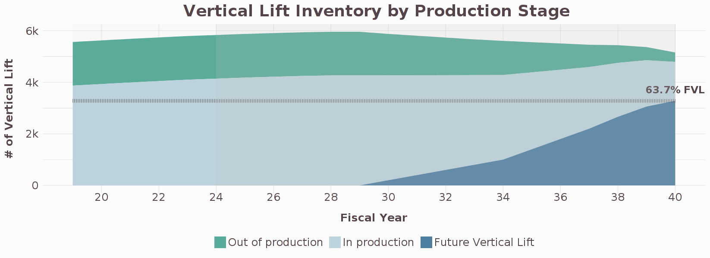

# Build your own vertical lift fleet

We designed this app to give our audience the ability to build their own vertical lift fleet. In seconds, you can see the impact that your custom fleet plan would have on a range of factors.  
You can build more helicopters, retire existing helicopters, develop new platforms, change the build / retire rate, adjust cost and performance assumptions, and much more. The factors that we account for include 
- acquisition cost
- operations and support costs
- research and development costs
- crew size
- passenger capacity
- speed
- range
- takeoff weight
  
The U.S. military faces the challenge of how to allocate resources between operating existing fleets, maintaining industrial capacity, and developing new capabilities. These decisions involve many stakeholders, including leaders within Congress, the White House, industry, Army, Navy, Marines, and Air Force.  
Unlike in many private sector industries, stakeholders in the public sector do not share access to tools that make it easy to understand and plan for investments. While key stakeholders can hold different and sometimes competing perspectives, there are many areas of common ground. But progress requires more than a shared vision. It also relies on developing a better understanding of our current plans and the potential impact of new investments.  
The impact of potential government investments is generally evaluated in terms of financial costs. And the list of investment options that get evaluated is quite short, limited mainly to legislative proposals or agency recommendations. We rely primarily on the Congressional Budget Office for these types of assessments, whose role is to provide independent analysis of the budgetary and economic impact that public policies may have. For instance, the CBO provides helpful reports that examine the specific costs associated with Department of Defense proposals. But why stop there?  
First, we should more comprehensively evaluate government investments to include other factors such as personnel requirements, the impact on jobs, and the implications on capacity or capabilities. Second, we should have the ability to evaluate a longer list of investment options and to compare those plans against each other. This app is designed to do just that for the U.S. vertical lift fleet, and is just one small step in that direction.  

